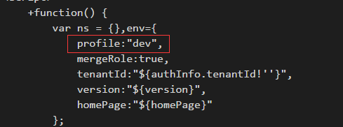

#### 配置模板文件

> 在index.ftl文件中，这是模板文件的入口。将CSS/库js文件都引入进来。
主要分为几大类：
css
commonJs
uiJs
coreJs


> css

```
<link href="web/theme/index.css" rel="stylesheet">
<link href="web/theme/theme.css" rel="stylesheet">
<link href="web/common/fontawesome/css/font-awesome.min.css" rel="stylesheet">
<link href="web/common/scrollbar/jquery.mCustomScrollbar.min.css" rel="stylesheet">
<link href="web/ui/antd2x/antd.min.css" rel="stylesheet">
<link href="web/common/plupload/plupload.css" rel="stylesheet">
<link href="web/ui/css/smart.css" rel="stylesheet">
<link href="web/ui/css/main.css" rel="stylesheet">
<link href="web/ui/theme/smart-icons.css" rel="stylesheet">
```

> commonJs


```
<script src="web/common/jquery/jquery-1.11.3.min.js"></script>
<script src="web/common/util-all.js"></script>
<script src="web/config/log4js.config.js"></script>
<script src="web/common/jquery.ba-hashchange.min.js"></script>
<script src="web/common/react/react.js"></script>
<script src="web/common/react/react-with-addons.js"></script>
<script src="web/common/react/react-dom.js"></script>
<script src="web/common/react-draggable.min.js"></script>
<script src="web/common/plupload/plupload.full.min.js"></script>
<script src="web/common/scrollbar/jquery.mCustomScrollbar.concat.min.js"></script>
<script src="web/common/react/browser.min.js"></script>
```


>uiJs

```
<script src="web/theme/index.js"></script>
<script src="web/ui/antd2x/antd.min.js"></script>
<script src="web/ui/SmartUI.js"></script>
<script src="web/ui/wegits/main.min.js"></script>
<script src="web/ui/react-debug.js"></script>

```


>coreJs

```
<script src="web/core/main.js"></script>
```


> 注意修改profile 为 dev模式



> web/ui/react-debug.js 是为jsx文件做翻译的


> 首先是将smartms的web目录拷贝过来，然后又将smartas打包编译之后

E:\SOURCE\SmartAs\target\generated-sources\web 目录拷贝过来组合成所有静态资源文件夹


> 如下路径下的index.js文件包含了加载菜单的一个js函数，注意匹配路径

```
Resource.get('services/security/menu/navbar',function(data){

E:\SOURCE\SmartAs\target\generated-sources\web\theme

```