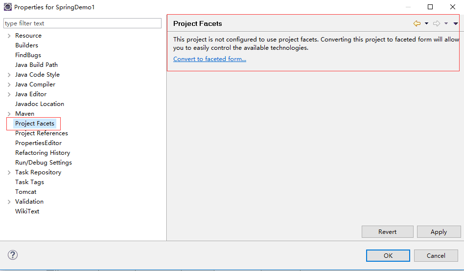
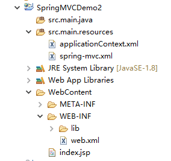
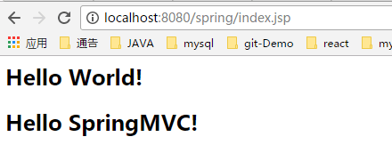

#### Eclipse下搭建SpringMVC项目
* 首先新建一个Javaproject 

* 点击project facts，将SE项目convert成web项目 

* eclipse会自动添加一个webContent目录 

* 赋予工程的springmvc特性，配置web.xml，使其具有springmvc特性，主要配置两处，一个是ContextLoaderListener，一个是DispatcherServlet。 

	<!-- 配置contextConfigLocation -->
	<context-param>
		<param-name>contextConfigLocation</param-name>
		<param-value>classpath*:applicationContext.xml</param-value>
	</context-param>

	<!-- Creates the Spring Container shared by all Servlets and Filters -->
	<listener>
		<listener-class>org.springframework.web.context.ContextLoaderListener</listener-class>
	</listener>

	<!-- 配置DispatcherServlet表示，该工程将采用springmvc的方式。启动时也会默认在/WEB-INF目录下查找XXX-servlet.xml作为配置文件，
        XXX就是DispatcherServlet的名字，该文件中将配置两项重要的mvc特性：HandlerMapping,负责为DispatcherServlet这个前端控制器的请求查找Controller；
        ViewResolver,负责为DispatcherServlet查找ModelAndView的视图解析器。
                     此处使用指定的配置文件spring-mvc.xml -->
	<servlet>
		<servlet-name>web-context</servlet-name>
		<servlet-class>org.springframework.web.servlet.DispatcherServlet</servlet-class>
		<init-param>
			<param-name>contextConfigLocation</param-name>
			<param-value>classpath*:/spring-mvc.xml</param-value>
		</init-param>
		<load-on-startup>1</load-on-startup>
	</servlet>
	<servlet-mapping>
		<servlet-name>web-context</servlet-name>
		<url-pattern>/.*</url-pattern>
	</servlet-mapping>

* 配置ContextLoaderListener表示，该工程要以spring的方式启动。启动时会默认在/WEB-INF目录下查找 applicationContext.xml作为spring容器的配置文件，这里可以初始化一些bean，如DataSource等 

* 配置DispatcherServlet表示，该工程将采用springmvc的方式。启动时也会默认在/WEB-INF目录下查找XXX- servlet.xml作为配置文件，XXX就是DispatcherServlet的名字，该文件中将配置两项重要的mvc特性：ViewResolver,负责为DispatcherServlet查找ModelAndView的视图解析器。这里我们使用指定的xml配置文件spring-mvc.xml 

* 在Tomcat安装目录下找到\conf\Catalina\localhost目录。复制粘贴一个xml文件，文件名称就是项目的上下文。主要内容是修改docBase属性值，选择使用的数据库。 

	<Context reloadable="true" docBase="E:\JAVA_WORKSPACE\SpringMVCDemo2\WebContent" >
		<Loader className="org.apache.catalina.loader.DevLoader" reloadable="true" debug="1" useSystemClassLoaderAsParent="false" />
		<!-- MySQL -->
		<Resource 
			 name="jdbc/SmartAsDS"
			 factory="com.alibaba.druid.pool.DruidDataSourceFactory"
			 auth="Container"
			 type="javax.sql.DataSource"
			 driverClassName="com.mysql.jdbc.Driver"
			 url="jdbc:mysql://localhost/oic?useUnicode=true&amp;characterEncoding=UTF-8&amp;useFastDateParsing=false&amp;allowMultiQueries=true"
			 username="root"
			 password="123"
			 maxActive="50"
			 maxWait="10000"
			 removeabandoned="true"
			 removeabandonedtimeout="60"
			 logabandoned="false"
			 poolPreparedStatements="false"
			 maxPoolPreparedStatementPerConnectionSize="20"
			 filters="wall,stat,log4j"/>
	</Context>

* 启动Tomcat，浏览器输入地址

