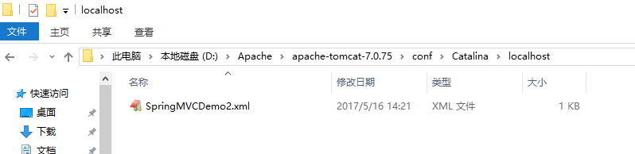
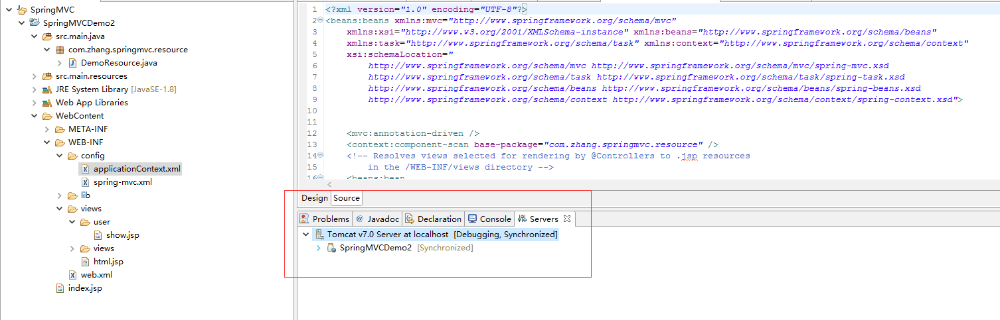

#### eclipse中的Service启动web项目

目前遇到一个问题，通过eclipse的Service启动项目，相同的URL路径访问这里生效。

http://localhost:8080/SpringMVCDemo2/test/viewName/

在D:\Apache\apache-tomcat-7.0.75\conf\Catalina\localhost路径下新建一个xml文件

