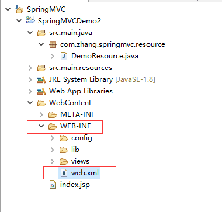

#### web.xml标签的配置
* 首先web.xml始终位于WEB-INF目录下面



* 配置监听器，监听器是必须要配置的。有时候起的时候报错是因为lib目录下没有jar包

```
	<!-- Creates the Spring Container shared by all Servlets and Filters -->
	<listener>
		<listener-class>org.springframework.web.context.ContextLoaderListener</listener-class>
	</listener>
```

* 配置Servlet
> 配置DispatcherServlet表示，该工程将采用springmvc的方式。启动时也会默认在/WEB-INF目录下查找XXX-servlet.xml作为配置文件，
  XXX就是DispatcherServlet的名字，该文件中将配置两项重要的mvc特性：HandlerMapping,负责为DispatcherServlet这个前端控制器的请求查找Controller；
  ViewResolver,负责为DispatcherServlet查找ModelAndView的视图解析器。此处使用指定的配置文件spring-mvc.xml

```
	<servlet>
		<servlet-name>web-context</servlet-name>
		<servlet-class>org.springframework.web.servlet.DispatcherServlet</servlet-class>
		<init-param>
			<param-name>contextConfigLocation</param-name>
			<param-value>WEB-INF/spring-mvc.xml</param-value>
		</init-param>
		<load-on-startup>1</load-on-startup>
	</servlet>
	<servlet-mapping>
		<servlet-name>web-context</servlet-name>
		<url-pattern>/</url-pattern>
	</servlet-mapping>

```

* url-pattern 配置的时候要注意

###### url-pattern配置为"/"和"/*"的区别
> 首先大家都知道"/*"可以匹配所有url，包括带扩展名的，一般只用在过滤器上。
  而"/"很多人理解成不能拦截带扩展名的，这种理解是错误的！它其实也能拦截“.js”，“.css”，".png"等静态资源的访问。
  看官方文档可知，它是tomcat的默认servlet，当其他的url-pattern匹配不上时都会走这个servlet。它除了能够处理静态资源还能够处理HTTP缓存请求，
  媒体（音频/视频）数据流和文件下载简历。所以如果我们的项目中配置了"/"，会覆盖掉tomcat中的default servlet。

```
	所以当springMVC的前端控制器配置为“/”时，需要在主配置文件中配置放行静态资源。
	第一种：
	<!-- 放行静态资源 -->
	<mvc:resources location="/js/" mapping="/js/**"/> 
	<mvc:resources location="/css/" mapping="/js/**"/>
	 <mvc:resources location="/images/" mapping="/js/**"/>
	第二种：
	<mvc:default-servlet-handler />
```