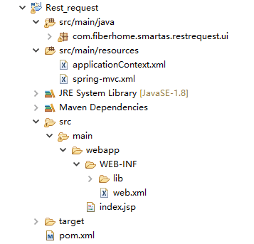

#### Maven搭建Web项目
* 新建一个Maven项目，目录结构如下：

* 理解build path 和web-INF/lib 包引用的差异

> build path&WEB-INFO/lib介绍
build path：可以说是引用； 
WEB-INFO/lib：可以说是固定在一个地方； 
eclipse编译项目的时候是根据build path的，如果不用eclipse来发布项目的话，就会出现找不到jar，
tomcat运行项目首先是在它自己的公共lib里找jar，如果找不到的话就会去项目的WEB-INFO/lib目录找，如果找不到就报错。

> WEB-INF是Java的WEB应用的安全目录。所谓安全就是客户端无法访问，只有服务端可以访问的目录。 
如果想在页面中直接访问其中的文件，必须通过web.xml文件对要访问的文件进行相应映射才能访问。web.xml文件为网站部署描述XML文件，对网站的部署非常重要。 
Web-Inf文件夹中除了有classes文件夹和一个web.xml文件外、还有lib文件夹（用于存放需要的jar包）。

* 用maven搭建的项目目录结构有点区别，但只要理解了路径代表的意义就能自定义目录结构了。