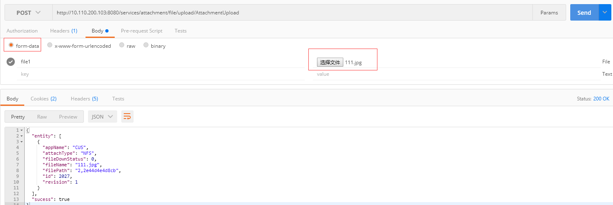
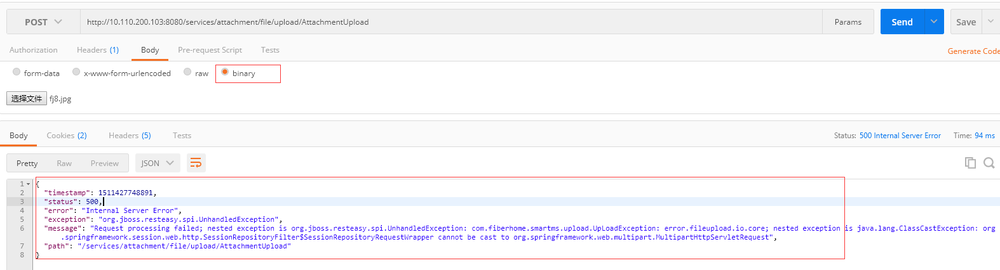

### postman测试文件上传接口
postman测试文件上传接口时，应该选择Body下面的form-data格式。能上传成功。



查看body里面的内容如下：看到有POST,Host,Cookie,Token,Content-type=multipart/form-data

```
POST /services/attachment/file/upload/AttachmentUpload HTTP/1.1
Host: 10.110.200.103:8080
Cookie: JSESSIONID=9a2ac241-f1f1-443e-b737-79a68e85b5ac
Cache-Control: no-cache
Postman-Token: 49a97217-fb50-ba2a-9091-aeaa10ae41e7
Content-Type: multipart/form-data; boundary=----WebKitFormBoundary7MA4YWxkTrZu0gW

----WebKitFormBoundary7MA4YWxkTrZu0gW
Content-Disposition: form-data; name="file1"; filename="undefined"
Content-Type: undefined


----WebKitFormBoundary7MA4YWxkTrZu0gW
```

其中Content-type=multipart/form-data这个是最关键的。

用如下方式测试的话报错




